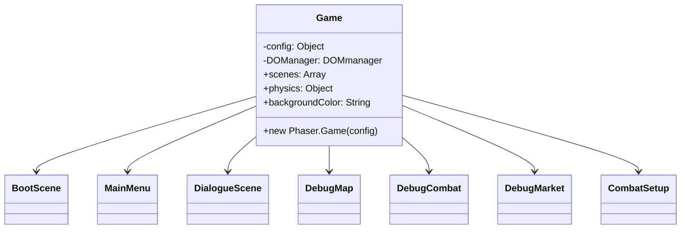
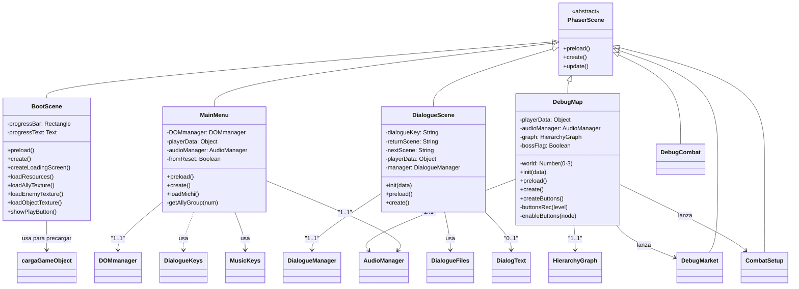
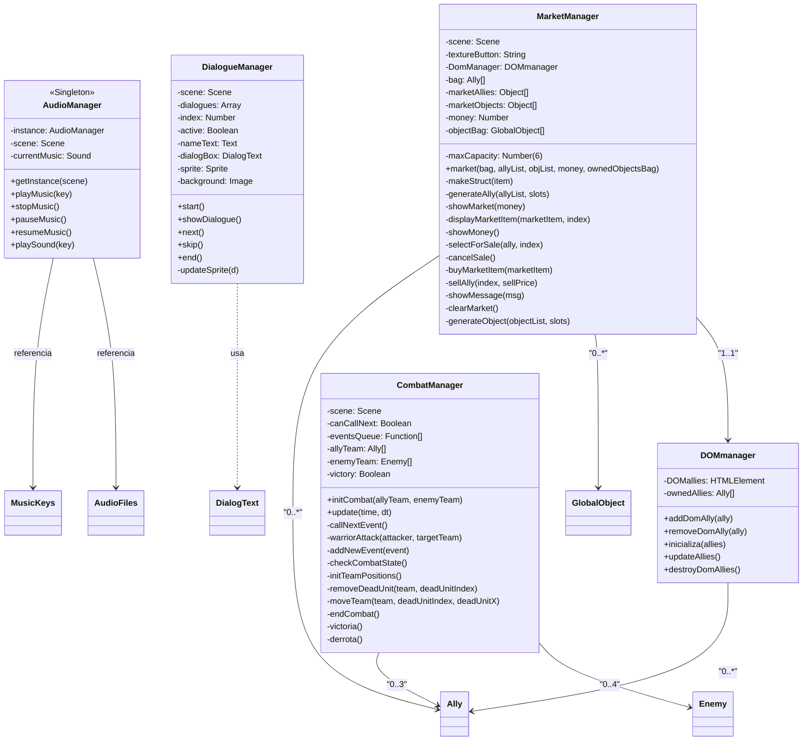
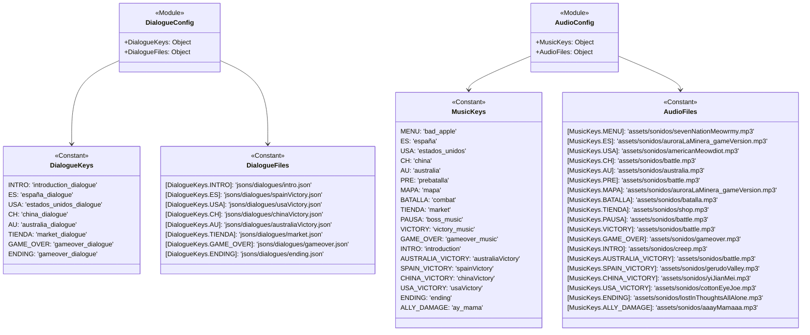
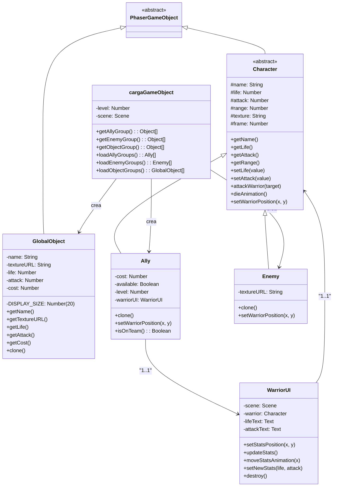
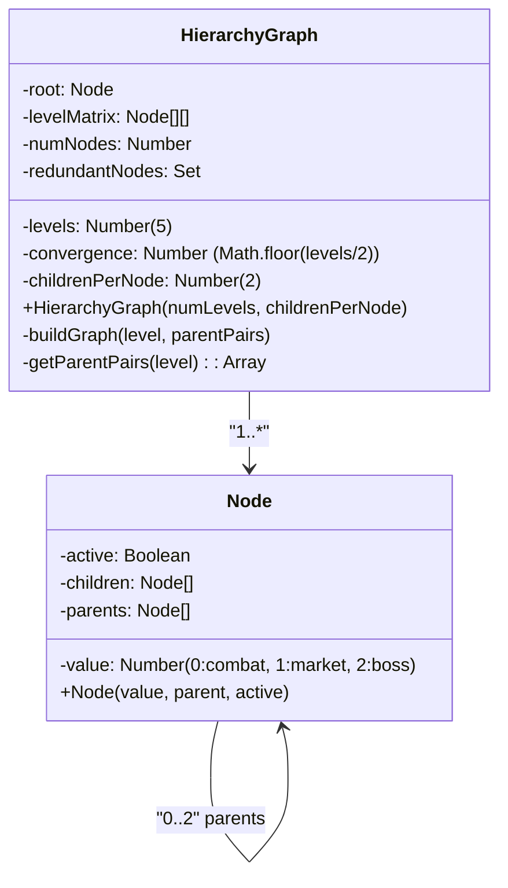

# SISTEMA DE JUEGO PRINCIPAL



# JERARQUÍA DE ESCENAS



# SISTEMA DE GESTIÓN



# SISTEMA DE CONFIGURACIÓN DE DATOS



# SISTEMA DE OBJETOS DEL JUEGO



# SISTEMA DE GRÁFICOS DE JERARQUÍA



# ESTRUCTURAS DE DATOS

## Objeto playerData
```
playerData: {
    ownedAllies: Ally[],          // Aliados comprados/obtenidos
    money: Number,                // Dinero actual (ej: 20)
    level: Number,                // Nivel actual (0-3)
    ownedObjects: GlobalObject[], // Objetos comprados
    reset: Boolean                // Si viene de un reset
}
```

## Estructuras de JSON

### allyGroup.json
```
{
    "ally0": [
        {
           
        }
    ],
    "ally1": [...],
    "ally2": [...],
    "ally3": [...]
}
```

### enemyGroup.json
```
playerData: {
    ownedAllies: Ally[],          // Aliados comprados/obtenidos
    money: Number,                // Dinero actual (ej: 20)
    level: Number,                // Nivel actual (0-3)
    ownedObjects: GlobalObject[], // Objetos comprados
    reset: Boolean                // Si viene de un reset
}
```

### dialogues/intro.json
```
playerData: {
    ownedAllies: Ally[],          // Aliados comprados/obtenidos
    money: Number,                // Dinero actual (ej: 20)
    level: Number,                // Nivel actual (0-3)
    ownedObjects: GlobalObject[], // Objetos comprados
    reset: Boolean                // Si viene de un reset
}
```
### objects.json
```
playerData: {
    ownedAllies: Ally[],          // Aliados comprados/obtenidos
    money: Number,                // Dinero actual (ej: 20)
    level: Number,                // Nivel actual (0-3)
    ownedObjects: GlobalObject[], // Objetos comprados
    reset: Boolean                // Si viene de un reset
}
```


# JERARQUÍA DE ESCENAS

```mermaid

```

# JERARQUÍA DE ESCENAS

```mermaid

```

# JERARQUÍA DE ESCENAS

```mermaid

```

# JERARQUÍA DE ESCENAS

```mermaid

```

# JERARQUÍA DE ESCENAS

```mermaid

```
