# SISTEMA DE JUEGO PRINCIPAL

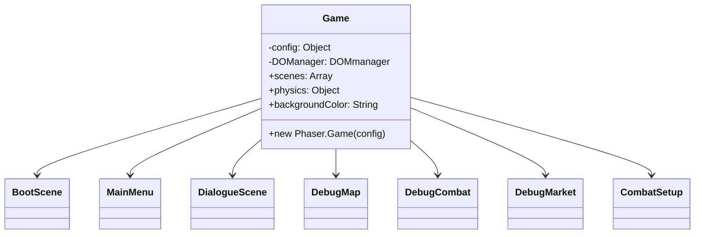

# JERARQUÍA DE ESCENAS


# SISTEMA DE GESTIÓN

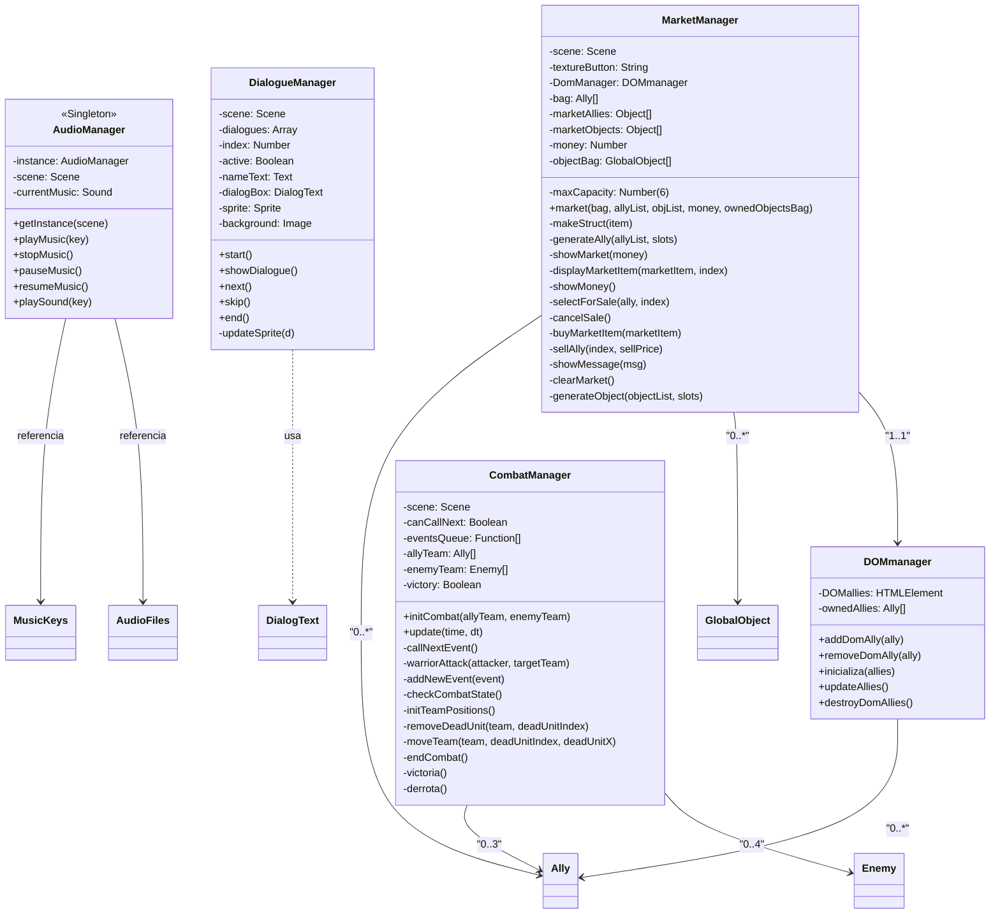

# SISTEMA DE CONFIGURACIÓN DE DATOS


# SISTEMA DE OBJETOS DEL JUEGO

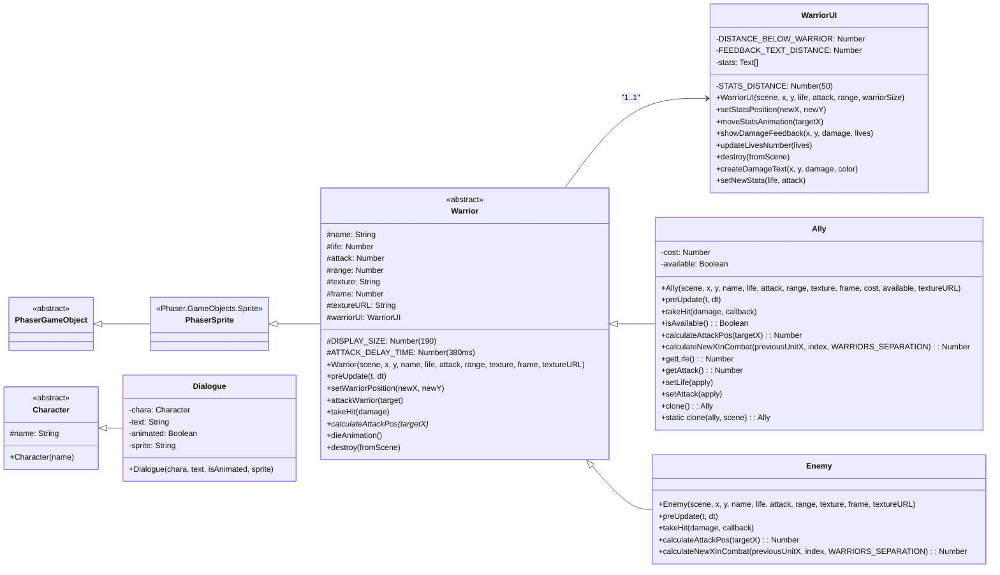

# SISTEMA DE GRÁFICOS DE JERARQUÍA

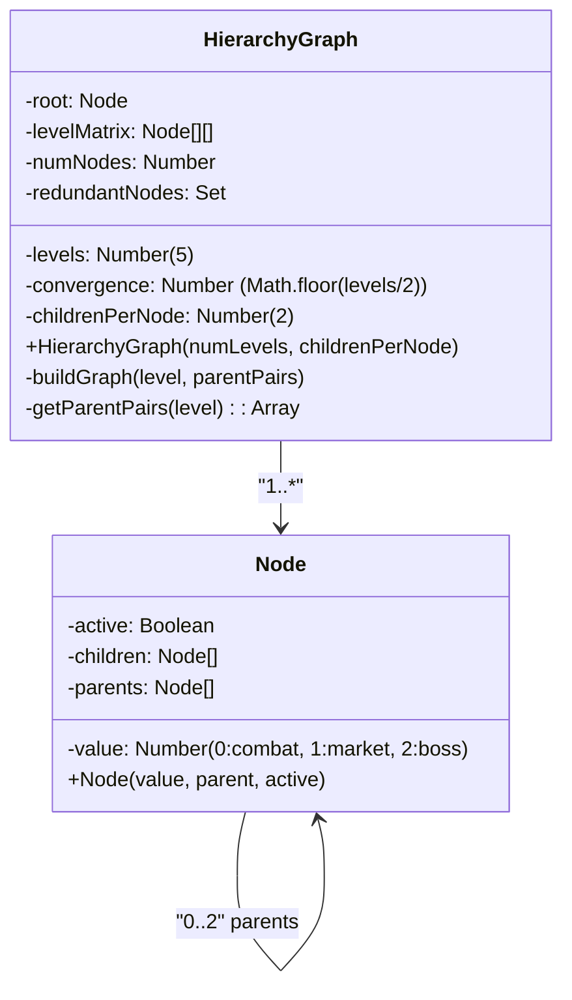
# SISTEMA DE DIÁLOGOS

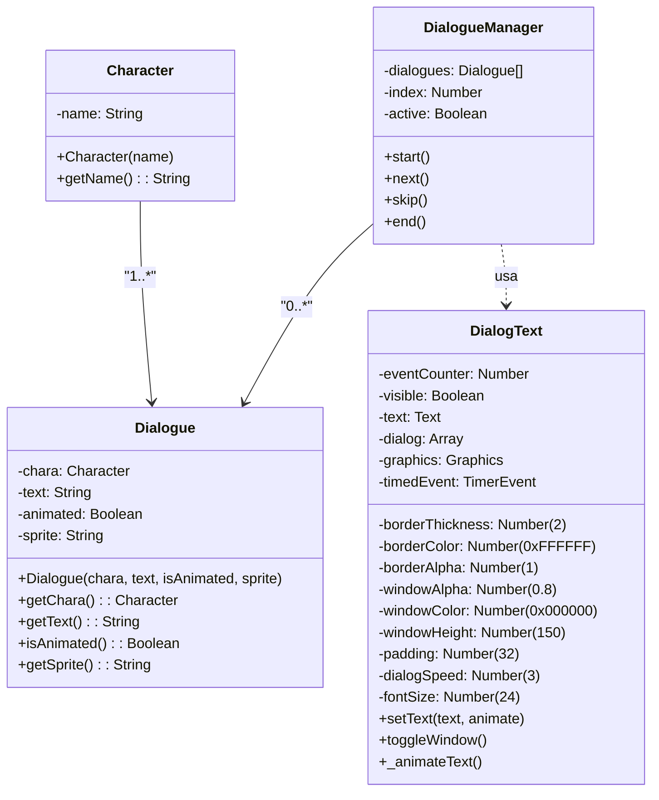

# SISTEMA DE AUDIO

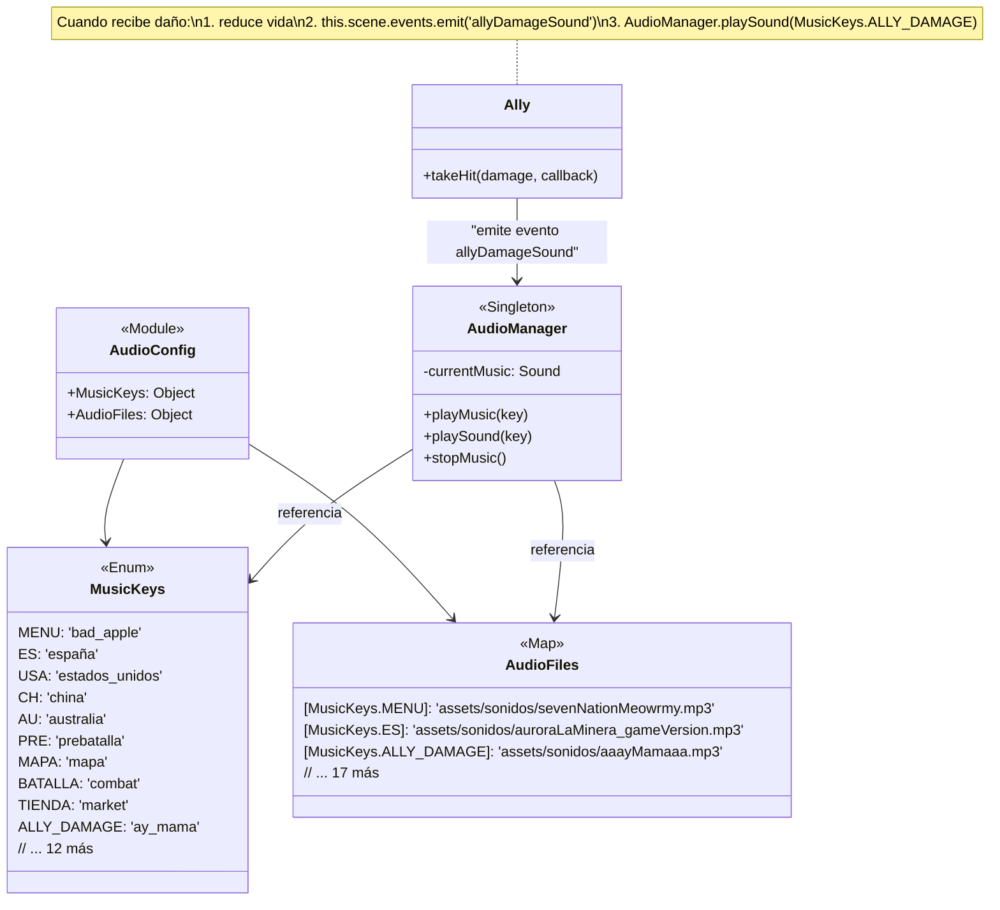

# FLUJO DE DAÑO Y ANIMACIONES

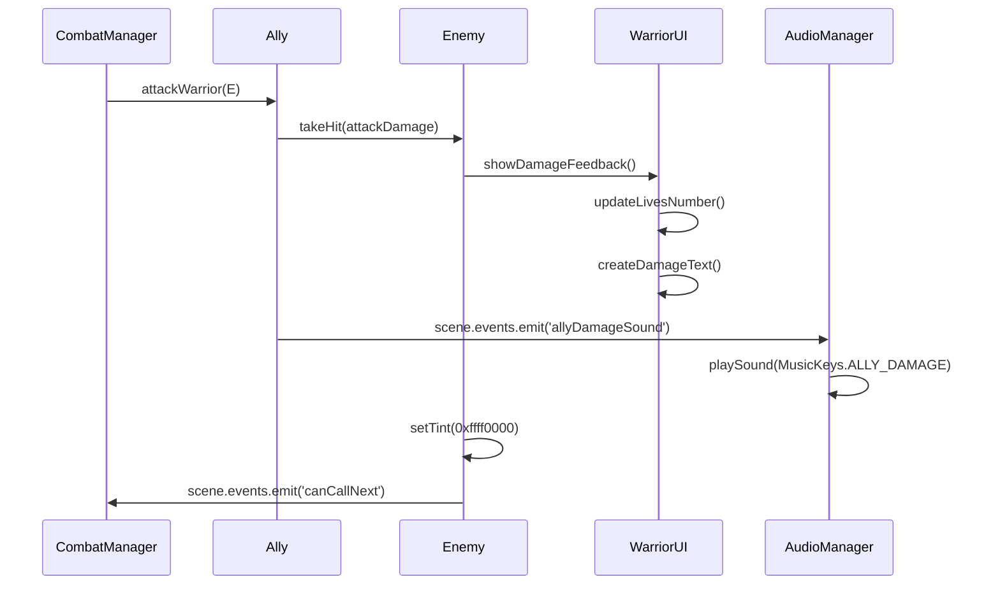

# RELACIONES

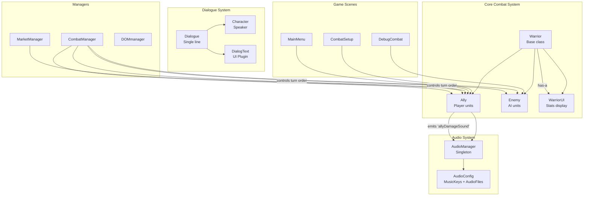

# ESTRUCTURAS DE DATOS

## Objeto playerData
```
playerData: {
    ownedAllies: Ally[],          // Aliados comprados/obtenidos
    money: Number,                // Dinero actual (ej: 20)
    level: Number,                // Nivel actual (0-3)
    ownedObjects: GlobalObject[], // Objetos comprados
    reset: Boolean                // Si viene de un reset
}
```

## Estructuras de JSON

### allyGroup.json
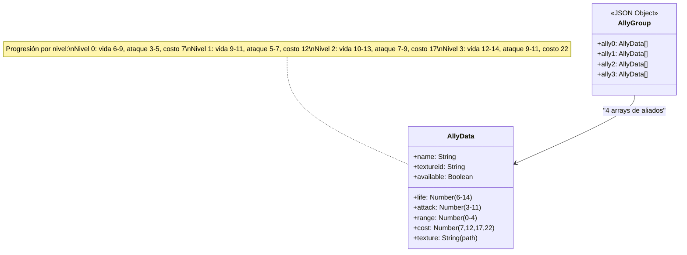

### enemyGroup.json
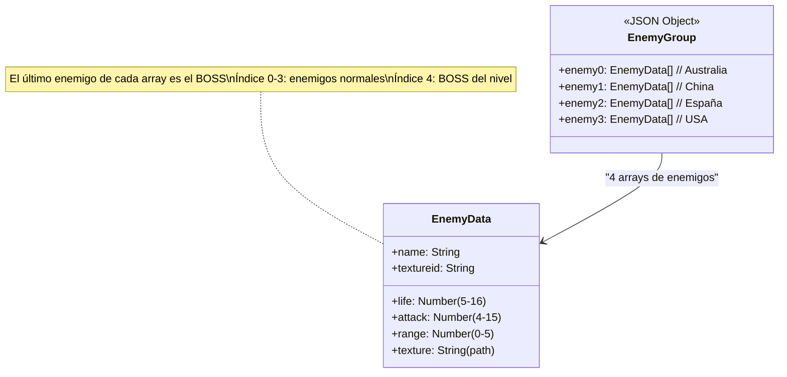

### objects.json
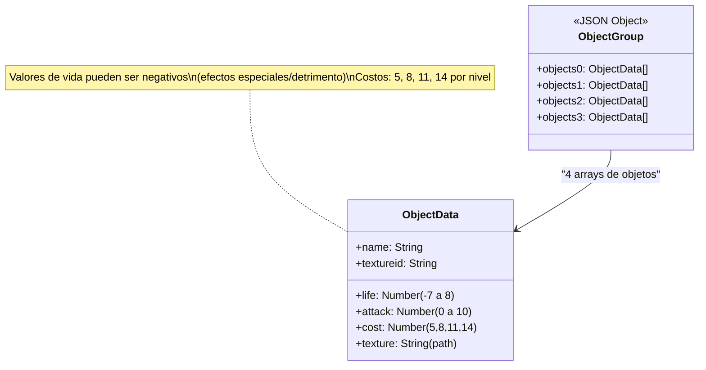

### Relación de diálogos
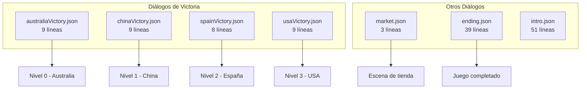

# PROGRESIÓN
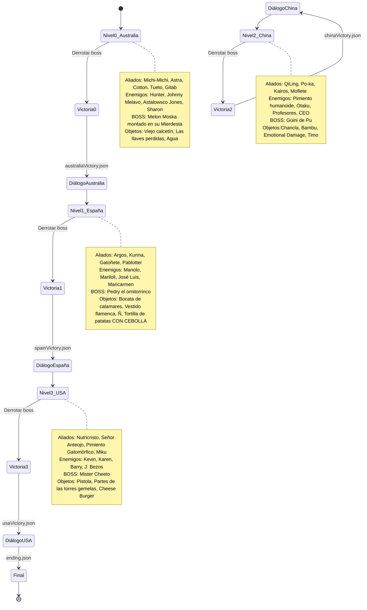


