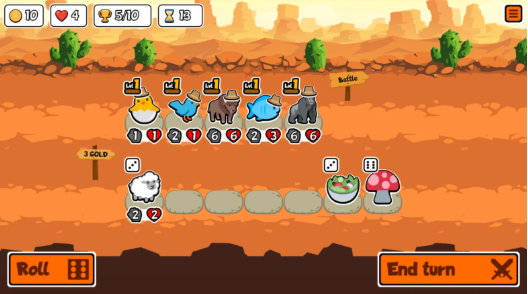

# **The Furrytastic Invasion** 

## Equipo de desarrollo:

Lucía Mei Domínguez López

Isabel Serrano Martín

Sergio López Gómez

Liling Chen

## 1. **Resumen**

### 1.1. **Descripción**

The Furrytastic Invasion es un **roguelite autobattler** en el que ayudamos a un gato antropomórfico en el que se encuentra planeando un golpe contra la humanidad, empezando con Australia. En sus planes, nosotros, como jugador y ayudante, nos encargaremos de reclutar, gestionar y organizar estrategias para la batalla contra el bando enemigo, los humanos, ya que harán cualquier idiotez para mantener sus tierras.

### 1.2. **Género**

Juego del género de estrategia con subgénero **roguelike autobattler** inspirado en otros juegos como **Teamfight Tactics** o **Super Auto Pets**.

### 1.3. **Público objetivo**
Jóvenes universitarios aficionados a los juegos de estrategia y autobattler que estén familiarizados con la cultura de internet y las noticias actuales.

### 1.4. **Setting**
Nuestro protagonista, Michi-Michi, que, cansado de la estupidez y codicia humana, decidió iniciar una guerra contra la humanidad empezando por invadir Australia. Le pide ayuda al jugador para la guerra, rompiendo las fronteras entre la realidad y el juego. Para ello, debe reclutar a otros animales antropomórficos que estén dispuestos a luchar por su causa: crear un mundo justo y pacífico para los animales antropomórficos.

Después de invadir Australia y convertirla en el primer país invadido y conquistado por los animales antropomórficos, sus siguientes planes pondrán ojo en: España, Estados Unidos y China.

### 1.5. **Características principales**
- Combate **autobattler**. El jugador podrá elegir qué animales formarán parte de su ejército y qué objetos usar para mejorarlos.

- El jugador podrá comprar animales para su ejército con distintas estadísticas en la tienda y objetos que mejoren las estadísticas de su ejército actual. Se desbloquean nuevos animales y objetos a medida que conquista cada país.

- El mapa del mundo se generará de manera aleatoria al inicio de la partida, a partir de distintas salas con diferentes conjuntos de enemigos prefabricados.

    - Estas salas tienen diferentes iconos según la recompensa (dinero u objeto).
    - Las tiendas se generan y se reparten por el mapa, pero evitando que el jugador tenga para elegir dos salas de tienda o que después de haber elegido tienda vuelva a tener la posibilidad de repetir dicha sala.
- Cada vez que el jugador consigue superar un combate, se le recompensará con monedas que luego podrá usar en la tienda para mejorar su ejército.
- **Arte**: Estilo de libro infantil hecho con ceras, acuarelas y recortables de papel y una paleta de colores de tonos diversos y vivos.
- **Música**: Música nostálgica infantil con tonalidad alegre.

## 2. **Gameplay**
### 2.1. **Objetivo del juego**
El objetivo del juego es superar todos los combates de cada país  y así conseguir que los animales antropomórficos ganen la guerra, que implica organizar y crear un ejército mediante sus propias decisiones antes del combate.

**Se gana** eliminando todo el ejército enemigo en todos los combates y también al jefe de cada país, el jugador no puede ser derrotado en ningún momento. Las tiendas serán de gran ayuda para el progreso de la invasión. Además, en algunos combates puedes obtener objetos que te ayudarán en el proceso.

**Se pierde** cuando el ejército del jugador es eliminado por el del enemigo, pero al iniciar una nueva partida guardas los animales que has desbloqueado y no los tienes que volver a desbloquear.

### 2.2. **Core loops**
El core loop del juego es el siguiente:

    (1) El jugador elige la sala en la que moverse (parecido al Slay the spire).

    (2) Si la sala es la tienda, compra o pasa a la siguiente.

    (3) Si la sala es de combate, prepara su ejército.

    (4) Los dos bandos luchan entre sí.

    (5) Si gana, pasa al mapa para elegir la siguiente sala.

    (6) Si pierde, debe comenzar el juego de nuevo desde cero, pero no tiene que volver a desbloquear los animales que ya desbloqueó en la tienda.

*Slay the Spire*

- **Elementos del escenario**

    - **Elementos interactuables:**
        - Organización de los animales antropomórficos antes de la batalla.
        - Compras de objetos y animales  en las tiendas.
        - Los botones del DOM de la página web que usas para quitar y añadir animales al ejército.
        - Selección de la sala a avanzar.
        - Menú principal y menú de pausa.

    - **Elementos no interactuables:**
        - Enemigos.
        - Escenario.

## 3. **Mecánicas**
### 3.1. **Compra**
En las salas de tienda, un pájaro antropomórfico mercader le dará la opción al jugador de utilizar sus monedas, cuya cantidad se muestra arriba a la derecha de la pantalla, para comprar un animal para su ejército. El jugador podrá elegir entre 3 animales distintos y/o entre 2 objetos distintos y pasar a la siguiente pantalla, donde elegirá la siguiente sala. También puede salir de la tienda sin comprar.

Cada animal antropomórfico tendrá distintas estadísticas, vida, ataque y rango de ataque. La vida y el ataque se muestran debajo del animal y cuando se cliquea al animal o se pasa el cursor por encima se muestra el rango de ataque.

También se va a ofrecer la compra de objetos para la mejora de las estadísticas de los integrantes, sea aumento de vida o de ataque o ambas.

El precio de cada animal dependerá del país, en el primer país los costes serán más baratos y a medida que va progresando el jugador, se va desbloqueando nuevos objetos y aliados, pero los precios de estos serán más caros que los del país inicial, por ende no se puede comprar ni desbloquear animales de otros países si el jugador no avanza.

**Precios**

| **Países** | **Aliados** | **Objetos** |
|:-----------:|:-----------:|:------------:|
|Australia|10 monedas|5 monedas|
|España|20 monedas|10 monedas|
|Estados Unidos|30 monedas|15 monedas|
|China|40 monedas|20 monedas|

*//parámetros provisionales*

***Parámetros***
- Cantidad de animales y/u objetos a comprar.
- Coste de cada objeto y/o animal.
- Cantidad de dinero del jugador.
- Cantidad de objeto y/o animal comprado, será una unidad con cada compra

*Super Auto Pets*

### 3.2. **Combate**

Por clarificar el combate, el core loop sería el siguiente:
1. El jugador entra en la sala de preparación de combate.
2. El jugador elige los guerreros a utilizar. Los guerreros disponibles estarán en la propia página web y fuera del canvas, y al seleccionarlos cambiará su saturación a 0.
3. Si el jugador deselecciona uno de sus guerreros, este se borrará de la lista y los siguientes bajarán un puesto, dejando un hueco al final para añadir otro.
4. Al elegir los guerreros, podrá pulsar un botón que le llevará a la siguiente fase.
5. En la siguiente fase, podrá utilizar objetos clicando sobre ellos y eligiendo el guerrero.
6. Al terminar la selección de objetos, se pasará al combate.

El combate será un autobattler visualmente parecido al Super Autopets, donde el jugador podrá colocar y organizar a su ejército antes de ver las del enemigo, y dependiendo de su vida y ataque ganarán o perderán.

Si un animal (tanto aliado como enemigo) es eliminado, entendiéndose por eliminado que su vida se reduce a cero o menos, el siguiente será el que continúe luchando contra el que queda en pie, y así sucesivamente hasta que uno de los dos bandos se quede sin ejército. Si el jugador se queda sin ejército en combate, perderá automáticamente; pero si se trata del otro bando, el jugador elegirá una sala del mapa para continuar con el juego.

En caso de que el combate termine en empate, no se pierde y ni se ganan monedas, pero se debe de repetir la sala hasta ganar y avanzar a la siguiente.

**Sistema de estadísticas de los animales y enemigo:**

**Vida**: Cantidad de vida que tiene el personaje. Cuando llega a cero o menos, este es derrotado y el siguiente será el que continúe luchando contra el que queda en pie.

**Ataque**: Daño que puede hacer el personaje.

**Rango de ataque**: Posición que puede alcanzar el aliado para atacar al enemigo, ya sea la primera, segunda o la última posición del ejército enemigo.

***Parámetros***: 
- Cantidad de guerreros del enemigo.
- Cantidad de guerreros aliados.
- Daño de cada guerrero.
- Vida de cada guerrero.

*Super Auto Pets*
#### 3.2.1. **Vida**
Cantidad finita expresada en número entero que poseen tanto aliados como enemigos y si se reduce a cero o menos quedan eliminados y los reemplaza el siguiente en caso de que haya.

Este parámetro se muestra en un icono debajo del animal/enemigo junto con el icono de la cantidad de ataque que realiza.

La vida de cada aliado se reinicia hasta su máximo cuando se gana el combate o cuando se empata en el combate. Este parámetro también puede ser mejorado con objetos o cuando se fusiona/une con otro aliado del mismo tipo.

***Parámetros***
- Cantidad de vida, números enteros

#### 3.2.2. **Ataque**
Daño que causan los aliados y enemigos para restar vida.

Este parámetro se muestra en un icono debajo del animal/enemigo junto con el icono de la cantidad de vida que tiene.

Cuando el ataque es mayor que la vida actual del personaje, el personaje será derrotado y pasará a la siguiente hasta que uno de los ejércitos se queden sin personajes o cuando se empata.

Este parámetro puede ser mejorado mediante el uso de los objetos o cuando se fusiona/une con otro aliado del mismo tipo.

***Parámetros***
- Cantidad de ataque, números enteros

#### 3.2.3. **Rango de ataque**
Distancia que los personajes pueden alcanzar para infligir daño al otro personaje del ejército contrario. 

El rango se diferencia desde 1 al 6 relacionándose con las posiciones de cada animal/enemigo:

|  |  |  |
|:-----------:|:-----------:|:-----------:|
| 6 5 4 3 2 1 | — – – – – – – | 1 2 3 4 5 6 |
| Aliado | – – – – – – – - | Enemigo |
|  |  |  |

Este parámetro será mostrado cuando el jugador clica o pasa el cursor por encima del personaje para saber cuál es su rango de ataque.

Si el personaje tiene rango 1 atacará al otro personaje en esa posición, en este caso, se corresponde al primer personaje, lo mismo será con el 2,3,4,5 y 6, siendo esta la última. Por defecto todos los personajes tienen rango 1 a no ser que se indique lo contrario.

En caso de que no haya personajes en esa posición, se atacará al último que queda. Por ejemplo: Si tenemos un aliado con rango 5 y tenemos solo 3 enemigos, quiere decir que ataca a la quinta posición del bando enemigo, pero como no hay, recurre al enemigo de la última posición, que será la tercera. 

Este parámetro es constante, no es posible de mejorar con objetos ni con la fusión/unión de los aliados.

***Parámetros*** 
- Rango de ataque, números enteros

### 3.3. **Objetos**
Elemento  que el jugador puede obtener comprando en tiendas o ganando en los combates si la sala tiene esa recompensa.

Cada objeto mejora la estadística de vida y/o ataque de los aliados por una cantidad constante. Después de su uso, el objeto se descarta del inventario, ya que es un elemento finito.

| **Nombre del objeto** | **Vida** | **Ataque** |
|:-----------:|:-----------:|:-----------:|
| Viejo calcetín    | -   | +3    |
| Las llaves perdidas | +5    | -  |
| Agua | +2    | +2    |

*//parámetros provisionales*

***Parámetros*** 
- Cantidad de vida que es añadida a la vida del aliado
- Cantidad de ataque que es añadida al ataque del aliado

### 3.4. **Gestión de los preparativos de combates (en el juego)**
Escenario en el que se muestra visualmente la organización del ejército. En él se podrá cambiar las posiciones de los animales y ver cada estadística de los animales (vida, ataque y rango de ataque) y sus niveles. Si hay dos animales del mismo tipo, se dará la opción de juntarlos, quedando un solo animal con mejores estadísticas.

Cuando los preparativos estén completados, el jugador tendrá que pulsar un botón para iniciar la batalla contra el ejército enemigo.

### 3.5. **DOM/Inventario (en la web)**
Espacio fuera del juego, localizado en la HUD de la página web, en el que se muestran los objetos y aliados comprados para crear el ejército.

Los aliados obtenidos en la compra de la tienda se mostrará en un panel lateral derecho de la HUD, será una UI constante en el que se muestra podrá ver de manera visual los recursos que tenga el jugador.

Se podrá gestionar dos elementos claves del juego: los animales y los objetos. Los dos se pueden adquirir en las tiendas, usando monedas para comprarlos y por recompensa en combates para los objetos.

Se podrá interactuar para seleccionar los animales y añadirlos al ejército o también objetos, para aplicarlo a los animales y mejorar sus estadísticas de vida y/o ataque. 

***Parámetros*** 
- Slots del inventario para los animales y objetos

### 3.6. **Gestión del dinero**
Al comienzo de la partida, el jugador comienza sin dinero, pero se conseguirá al final de cada combate si el jugador la ha superado. La cantidad de dinero obtenida en cada combate aumentará dependiendo de cuantos combates haya superado el jugador. El dinero ganado podrá ser gastado en las tiendas para comprar más aliados y objetos para la mejora de este.

La cantidad de dinero también será afectada por el tipo de sala: si la sala de combate implica una  recompensa de objeto, se obtendrá menos monedas y si es de jefe se obtendrá más monedas.

***Parámetros*** 
- Cantidad de monedas.

### 3.7. **Aliados**
Los aliados serán los animales antropomórficos que ayudarán al jugador a ganar los combates. Estos tienen en cada estadística una variable distinta.

Al comienzo de la partida el jugador empieza con un solo aliado, que será nuestro protagonista Michi-Michi.

El jugador podrá tener como máximo 6 aliados en combate y como mínimo 1 para poder empezar a combatir. 

Será posible mejorar las estadísticas de los aliados con los objetos, obtenidos de los combates o comprados en las tiendas y también mediante la unión/fusión de dos aliados iguales para su mejora, quedando un animal, pero con mejores estadísticas, el máximo nivel a la que puede mejorar es hasta 4.

| **Nivel** | **Vida** | **Ataque** |
|:-----------:|:-----------:|:-----------:|
| 1 |Original|Original|
| 2 | +1 | +1 |
| 3 | +2    | +2    |
| 4 | +3    | +3    |

| **Nombre** | **Vida** | **Ataque** |**Rango de ataque** |
|:-----------:|:-----------:|:-----------:|:-----------:|
| Michi-Michi |99|99|1|
| Gata alien | 3 | 6 |2|
| Mapache que lava el algodón de azúcar | 15 | 0 |1|
| Pez chancla |8|5   |4|
| Gato-Pulpo de Github | 8 | 8 |3|

*//parámetros provisionales*

***Parámetros*** 
- Cantidad de vida
- Cantidad de ataque
- Rango de ataque
- Cantidad de aliados en cada combate
- Nivel de los animales

### 3.8. **Enemigos**
Personajes humanoides que se enfrenta con los aliados, cada uno con distintas estadísticas y a medida que va avanzando el jugador en los países, se desbloqueará nuevos enemigos a enfrentar, tendrán la misma mecánica que las del aliado (vida, ataque y rango de ataque). En combate, la máxima cantidad de enemigos que puede haber será hasta 6 y mínima 1, excepto cuando está el jefe, en ese caso, habrá 3 enemigos y un jefe.

| **Nombre** | **Vida** | **Ataque** |**Rango de ataque** |
|:-----------:|:-----------:|:-----------:|:-----------:|
| Karen |1|1|1|
| //Emo | 3 | 2 |5|
| //Otaku | 9 | 7 |2|
| //Pimiento |66|66   |1|

*//parámetros provisionales*

***Parámetros*** 
- Cantidad de vida
- Cantidad de ataque
- Rango de ataque
- Cantidad de enemigos en cada combate

#### 3.8.1. **Jefes**
Los jefes son enemigos más importantes de cada país, siendo estos más grandes y con las mejores estadísticas de sus originales pero un poco mejores. En combate, cuando aparece un jefe, siempre estará acompañado de otros 3 enemigos normales. Siendo así que el jugador se enfrentará a 4 enemigos. 

El jefe aparece en cada tercer combate de cada país. Si el jugador gana el combate con el jefe, obtendrá más monedas y desbloqueará el siguiente país.

| **Nombre** | **Vida** | **Ataque** |**Rango de ataque** |
|:-----------:|:-----------:|:-----------:|:-----------:|
| Güini de Pu |20|10|1|
| Mister Cheeto | 35 | 14 |1|
| Melon Moska | 26 | 20 |1|
| Melon Moska montado en su Mierdesta |22|21   |1|
| Pedry el ornitorrinco |31|23   |1|

*//parámetros provisionales*

***Parámetros*** 
- Cantidad de vida
- Cantidad de ataque
- Rango de ataque

### 3.9. **Mapa**
El mapa estará dividido en tres zonas de forma preestablecida: dentro de estas cuatro zonas, se generará de manera aleatoria a partir de salas ya diseñadas. Estas salas deben estar agrupadas en nivel de dificultad (fácil, media, difícil) en cada zona, y al generar el mapa, cada zona solo dispondrá de las salas que correspondan a su nivel de dificultad, que irá aumentando progresivamente dividiéndose por 2 batallas de enemigos normales y otra con el jefe de cada zona.

**meter un esquema, y hay que diseñar el mapa**

Cuando el jugador avanza al siguiente país, se desbloquea nuevos aliados y objetos para la mejora del ejército, además de nuevos enemigos.

## 4. **Interfaz**
### 4.1. **Controles**
El jugador podrá interactuar con las interfaces del juego mediante clicks tanto con el ratón como con el panel táctil.

### 4.2. **Cámara**
Se tratará de una cámara estática que se centra en el escenario del juego de forma  lateral, mostrando la escena completa (sea escenario de tienda, batalla, mapa o donde se organiza el ejército del jugador). Se puede apreciar todos los componentes de cada sala como los elementos de la interfaz sin tapar detalles imprescindibles. La resolución de la pantalla es de 1920*1080. 

### 4.3. **HUD**

### 4.4. **Menús**
**hay que diseñar un par de menús y meterlos aquí**

## 5. **Mundo del juego**
### 5.1. **Personajes**
#### 5.1.1. Protagonista

#### 5.1.2. **Aliados**
Gato-Pulpo de Github

#### 5.1.3. **Enemigos**

#### 5.1.4. **NPC’s**
Mercader

### 5.2. **Niveles/Salas**

## 6. **Estética y contenido**
El estilo de dibujo para el juego estará inspirado en recortes de papel o dibujos sin gran detalle para darle un toque menos serio.

**Assets**
- Fondos
- Sprites
- Botones
## 7. **Enlace a GitHub**
https://github.com/lucdom07/G07-PVLI.git
## 8. **Referencias**
-Super Auto Pets (2021), Team Wood Games
-Slay the Spire (2017), MegaCrit
-Teamfight Tactics (2019), Riot Games

## 9. **Cartas**
Australia (A13)

Super autopets (M33)

DOM (M39)

Hades (M07)

Gato en una caja (P13)

